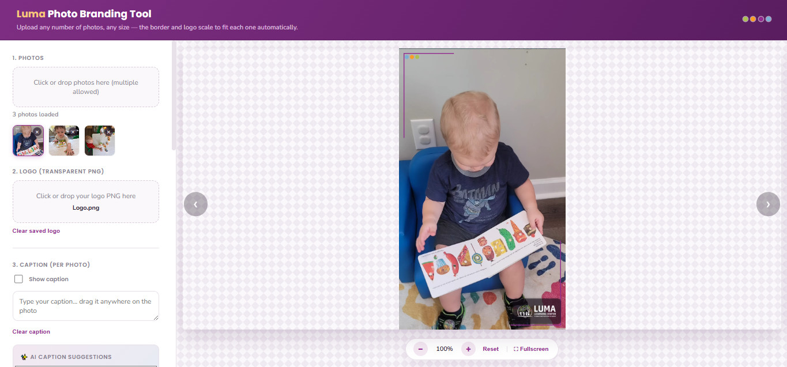
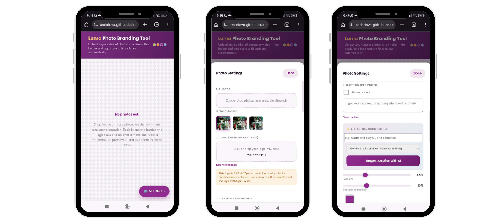

# Luma Photo Branding Tool

A personal, single-page tool for automatically applying my client's branded photo border (corner brackets, dots, and logo) to photos — built to save time instead of adding the border by hand in an editor for every photo.

  
  

**Note:** This is a personal project for my own workflow/task automation. It's not an official product of my client, and it isn't intended for public or commercial distribution — just a convenience tool I built for myself.

## What it does

- Upload one or more photos (any size, orientation, or dimensions)
- Automatically overlays the brand border — corner brackets, accent dots, and logo — scaled proportionally to each photo
- Adjustable border settings: corner arm length, edge margin, line thickness, dot size, dot position, logo size, and brand colors
- Optional contrast backing behind the logo so it stays visible on both light and dark backgrounds
- Add a caption to each photo, with adjustable font size, background padding, and color — draggable to any position
- **AI caption suggestions** (via Gemini API) — generates a short caption based on the photo and an optional style prompt, with a switchable model (Gemini 3.6 Flash or Gemini 3.1 Flash-Lite) depending on daily quota needs
- On mobile, a floating "⚡" button lets you generate an AI caption directly from the photo view without opening the settings drawer
- Smooth slide animation when moving between photos (desktop and mobile)
- Mobile-friendly settings drawer with native back-button support (closes the drawer instead of leaving the page)
- Zoom, pan, and fullscreen preview to check detail before exporting
- Download a single branded photo, or batch-download everything as a ZIP

## How to use it

1. Open `index.html` in a browser (Chrome, Edge, or Firefox recommended).
2. Drop in your logo PNG once (transparent background works best).
3. Drop in one or more photos.
4. Adjust the border/logo settings on the left if needed.
5. Optionally add a caption manually, or tap "Suggest caption with AI" for an auto-generated one.
6. Download the branded photo(s).

No installation, build step, or server required on the frontend — it's a self-contained HTML file that runs entirely in the browser.

## Tech

- **Frontend:** Plain HTML, CSS, and JavaScript using the Canvas API for image compositing, plus JSZip (loaded via CDN) for batch ZIP downloads.
- **AI captioning backend:** A Google Apps Script Web App (`Code.gs`, included in this repo as a backup) proxies caption requests to the Gemini API. It requires a `GEMINI_API_KEY` set in the script's Script Properties — this is never stored in the code itself. The `.gs` file here is a backup copy; the live version is deployed separately through Google Apps Script.

## Status

Actively tweaked for personal use — settings and layout may change as I keep refining my own workflow.
